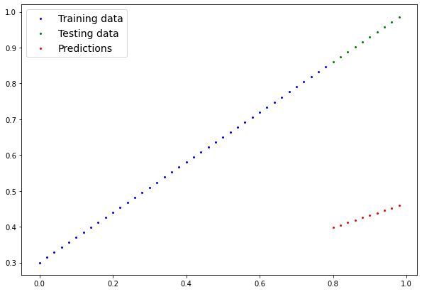
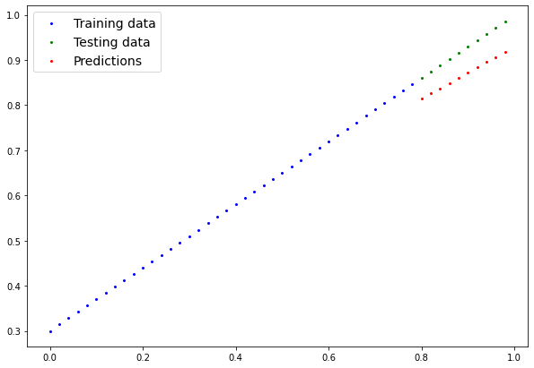
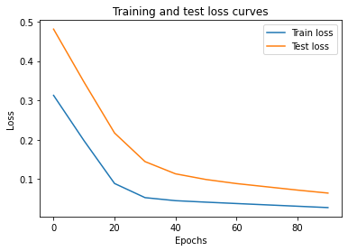

# PyTorch Basic Linear Regression Neural Network

A friendly implementation of Linear Regression using PyTorch to understand how neural networks learn under the hood.

This project demonstrates:

• Creating data using known parameters<br>
• Building a nn.Module model with trainable weights & bias<br>
• Training with Gradient Descent (SGD)<br>
• Using Autograd + Backpropagation<br>
• Loss optimization with L1 (MAE) loss<br>
• Manual training & evaluation loop (no high-level shortcuts)

Instead of using nn.Linear, the weights and bias are defined manually to clearly show how parameters update during training.

This project uses:

- **Python**
- **Pytorch**

## Get Started

Create a virtual environment before installing requirements.txt
Clone the repository:

```bash
git clone https://github.com/yashdeep7733/pytorch-fundamentals.git
cd pytorch-fundamentals
pip install -r requirements.txt
python /basic-pytorch-neural-network.py
```

<p align="center">
  
  
  
</p>
